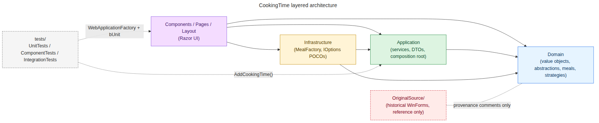

# CookingTime

> **A 20-year-old WinForms cooking calculator, refactored into a modern .NET 10 Blazor WebAssembly app under a disciplined `branch → checkpoint → ADR → docs` workflow.**

| | |
| --- | --- |
| **What it does** | Pick a meal (Whole Chicken, Beef Roast Standing Rib — Rare, Turkey, Pork, Ham …), enter a weight and a unit (lb or kg), get a cooking-time range + instructions. |
| **Tech** | C# · .NET 10 · **Blazor WebAssembly** · xUnit · Moq · FluentAssertions · bUnit · `WebApplicationFactory` · coverlet · GitHub Actions · Python |
| **Tests** | **118 automated facts** across unit, Razor component, and HTTP/integration tiers — all green |
| **Build** | `dotnet build -c Release` — **0 warnings, 0 errors** (`<TreatWarningsAsErrors>true</TreatWarningsAsErrors>`) |
| **Coverage** | **80 % line** on `CookingTime.UnitTests` production code; CI gate at **75 %** |
| **AI-assisted?** | **Yes** — end-to-end migration executed with an AI coding agent under the workflow documented below |

---

## Why this repo is interesting

The **product** is a one-page form. The **engineering story** is what you'd put on a resume.

1. **Inherited a ~700-line single-file WinForms app** with real bugs — a mutable value object whose setter wrote to the wrong field, an inverted kg/lb unit conversion, two `"Beef Roast Standing Rib — Rare"` entries where one of them was actually Medium, and three Range meals whose Max-minutes-per-pound was `0`.
2. **Migrated to .NET 10 Blazor WebAssembly** across 8 disciplined phases, applying SOLID + clean architecture + Strategy/Factory/Registry/Value-Object patterns.
3. **Wrote tests alongside the code** — 118 facts (xUnit for domain, bUnit for components, `WebApplicationFactory<Marker>` for end-to-end HTTP), all shipped with each phase.
4. **Built a blocking CI gate** — GitHub Actions runs `dotnet build` → per-project `dotnet test` with coverlet → a Python script that fails the build if `UnitTests` drops below 75 % line coverage on production code.
5. **Recorded every meaningful decision** as an append-only ADR; onboarding for a new contributor (or AI agent) is a 30-minute read of `docs/onboarding.md`.

The result is a working green build with **0 warnings, 118 tests, 80 % gated coverage**, and a documented, reproducible recipe for using an AI coding agent on a non-trivial .NET codebase.

---

## Architecture — at a glance

```
Domain/         → no project dependencies        value objects, abstractions, meals, strategies
Application/    → refs Domain                     calculator service, DTOs, single composition root
Infrastructure/ → refs Domain + Application       MealFactory, options POCOs
Components/     → refs all three                  Razor pages, layout, App.razor
wwwroot/        → static assets                   HTML, CSS, help files
tests/          → UnitTests / ComponentTests (bUnit) / IntegrationTests (WebApplicationFactory)
OriginalSource/ → historical WinForms             reference only — never referenced from new code
```

- **Composition root:** `Application/ServiceCollectionExtensions.AddCookingTime(...)`. Called once by `Program.cs` and once by the test host. No parallel wiring to drift.
- **OCP:** `MealTypeRegistry` registers kinds via `Register(MealKind, Func<IMeal>)`. New meals are additive — they never edit a switch.
- **Value objects:** `Weight` and `CookingDuration` are `readonly record struct` — the legacy mutable-VO bug class is **structurally impossible**.
- **Result-with-validation DTO:** `CookingResult`. The UI-facing calculator never throws for expected input problems.

### Architecture — visualized



> The same layering block, rendered. See [`docs/DIAGRAMS.md`](docs/DIAGRAMS.md) for the Mermaid source, the domain-class breakdown, the request-flow sequence, the 8-phase gitGraph, the AI-assisted workflow, and the CI pipeline (each rendered as a PNG under [`docs/diagrams/`](docs/diagrams/) and ready to drop into LinkedIn articles or slide decks).

---

## Migration journey — 8 phases, 0 rollbacks

| Phase | Branch | What shipped |
| --- | --- | --- |
| 0 | `phase/0-docs-scaffold` | Docs skeleton, locked master plan, ADRs 0001–0004 |
| 1 | `phase/1-blazor-host` | Blazor WASM host, csproj for `net10.0`, host-build tests |
| 2 | `phase/2-domain-layer` | `Weight`, `CookingDuration`, strategies, meals, factory+registry; CI smoke workflow |
| 3 | `phase/3-application-and-config` | `CookingTimeCalculator`, `MealFactory`, `appsettings.json`, DI wiring |
| 4 | `phase/4-razor-ui` | `EditForm` + DataAnnotations, `Pages/CookingTime.razor`, `About.razor`, `Help.razor`, bUnit |
| 5 | `phase/5-integration-and-feature-tests` | `WebApplicationFactory<Marker>`, shared DI, HTTP route + bUnit feature tests |
| 6 | `phase/6-cleanup` | Legacy WinForms files deleted (kept under `OriginalSource/`); ADR 0005 |
| 7 | `phase/7-ci` | Blocking CI gate, coverlet, Python coverage gate, ADR 0006 |

**Branch model:** one feature branch per phase; each ends with exactly one `checkpoint(phase-N): …` commit and a tag `v0.N-<slug>`.

---

## Bug fixes that didn't make it into a sprint review

| # | Legacy bug | Where it lived | Fix |
| --- | --- | --- | --- |
| 1 | **Mutable value object** — `MinimumTime` setter wrote to `m_MaxTime` | `OriginalSource/ComCookingTime.cs:360` | `CookingDuration` is a `readonly record struct` — class of bug is gone |
| 2 | **Inverted kg/lb conversion** — `structWeight.Weight` multiplied by `2.205` instead of dividing | `OriginalSource/ComCookingTime.cs:421` | Single conversion point in `Weight.FromKilograms`, factor `2.20462262M`, round-trip test |
| 3 | **Duplicate "Rare" label** — both `"Beef Roast Standing Rib — Rare"` entries labeled Rare; second was Medium | `OriginalSource/ComCookingTime.cs:500-503` | `appsettings.json` carries the corrected labels |
| 4 | **Half-built Range meals** — three entries with `aMax=0`, producing nonsense durations | `OriginalSource/ComCookingTime.cs:529+` | Every Range entry explicitly sets both min and max |
| 5 | **Concrete deps in UI** — `new CT.MealCreator()` in form constructor | `OriginalSource/frmCookingTime.cs:69` | UI depends on `ICookingTimeCalculator`; DI wires concretes |
| 6 | **Switch-on-string factory** — adding a meal meant editing `MealCreator.CreateMeal` | `OriginalSource/ComCookingTime.cs:444` | `MealTypeRegistry.Register` — OCP-friendly |

---

## CI / quality gate

Every PR and every push to `phase/*` runs:

```bash
dotnet restore
dotnet build -c Release --no-restore       # 0 warnings, 0 errors or fail
dotnet test --settings coverlet.runsettings.xml
python3 scripts/check-coverage.py \
  "$(ls -t tests/CookingTime.UnitTests/TestResults/*/coverage.cobertura.xml | head -1)" \
  --threshold 75                            # gate at 75% on UnitTests, fail if lower
```

The three Cobertura XMLs are uploaded as the `coverage-cobertura` artifact (14-day retention).

Measured baseline: **UnitTests 80.00 %**, ComponentTests 15.00 %, IntegrationTests 63.07 % (the latter two are informational; only UnitTests drives the gate).

---

## Tech stack

**Runtime:** .NET 10 · Blazor WebAssembly
**Language:** C# (latest lang version), nullable reference types on, file-scoped namespaces, `readonly record struct` VOs, `sealed` by default
**Patterns:** Strategy · Factory + Registry · Value Object · Adapter · Result-with-validation · Composition Root
**Testing:** xUnit 2.9 · Moq 4.20 · FluentAssertions 6.12 · bUnit 1.31 · `WebApplicationFactory<TEntryPoint>`
**Coverage:** coverlet.collector 6.0.2 + coverlet.msbuild 6.0.2 + custom Python gate
**DevOps:** GitHub Actions (`ubuntu-latest`, .NET 10 setup, NuGet cache), NU1902/NU1903 CVE handling scoped to test csprojs only
**Docs:** docs-as-code — `docs/plan.md` (locked), `docs/phases/phase-N-*.md`, `docs/decisions/000N-*.md` (append-only ADRs), `docs/onboarding.md`, `AGENTS.md`

---

## Quick start

```bash
dotnet restore
dotnet build -c Release                 # 0 warnings, 0 errors
dotnet test --settings coverlet.runsettings.xml
# Optional: run the coverage gate locally
python3 scripts/check-coverage.py \
  "$(ls -t tests/CookingTime.UnitTests/TestResults/*/coverage.cobertura.xml | head -1)" \
  --threshold 75
dotnet run                              # boots the Blazor app
```

---

## Documentation map

| Doc | Purpose |
| --- | --- |
| [`docs/plan.md`](docs/plan.md) | Locked master plan |
| [`docs/phases/`](docs/phases/README.md) | Per-phase truth (one file per phase) |
| [`docs/decisions/`](docs/decisions/README.md) | Append-only ADRs (0001–0006) |
| [`docs/onboarding.md`](docs/onboarding.md) | 30-minute newcomer orientation |
| [`docs/LINKEDIN.md`](docs/LINKEDIN.md) | LinkedIn / resume pitch + post copy |
| [`docs/SLIDES.md`](docs/SLIDES.md) | Slide-deck outline for talks / interviews |
| [`docs/ELEVATOR-PITCH.md`](docs/ELEVATOR-PITCH.md) | Three pitches (recruiter / senior engineer / architect) + Q&A prep |
| [`docs/COVER-LETTER.md`](docs/COVER-LETTER.md) | Cover-letter paragraphs tailored to role type |
| [`docs/DIAGRAMS.md`](docs/DIAGRAMS.md) | Mermaid sources + rendered PNGs (architecture, domain, sequence, branches, AI workflow, CI) |
| [`AGENTS.md`](AGENTS.md) | Standing rules for any AI agent (or human) working in this repo |
| [`README.md`](README.md) | This file |

---

## AI-assisted coding — what actually worked

The migration was driven by **AI-assisted coding**, but the durable artifact is the **workflow**, not the model.

- **Ground truth lives in the repo.** `AGENTS.md` + `docs/plan.md` + the ADRs + the per-phase docs are the single source of truth. The agent's hidden memory is irrelevant.
- **Branch + checkpoint discipline.** Every phase = one branch + one `checkpoint(phase-N): …` commit + one tag + one phase doc. Reverts are one `git reset --hard v0.<N>`.
- **Tests ship with code.** Each phase lands with unit + (where applicable) component / integration tests. CI must be green before merge.
- **Lint-as-errors.** `<TreatWarningsAsErrors>true</TreatWarningsAsErrors>` + `<NoWarn>NU1902;NU1903</NoWarn>` scoped to test csprojs only. A green build is a real green build.
- **Measured coverage is enforced.** `scripts/check-coverage.py` blocks any PR that drops `CookingTime.UnitTests` line coverage on production code below 75 %.

The AI tools and models used:

| | |
| --- | --- |
| **Agent environment** | Local coding agent following a `phase-execution` skill seeded with `docs/plan.md` |
| **Coding assistant** | GitHub Copilot in VS Code, paired with Ollama for local-model coding |
| **Model** | `minimax-m3:cloud` |
| **Skills used** | `phase-execution` (drives a single phase against the plan); `modernize-legacy-dotnet` (modernization patterns); ad-hoc reads of the ADRs to recover decision context |

This is the **demonstrable, repeatable recipe** for using a coding agent on a non-trivial .NET codebase without producing tech debt.

---

## Contributing / forking

See [`docs/plan.md`](docs/plan.md) for the original upgrade plan. ADRs are append-only; supersede with a new entry that links back. Branch convention per [`ADR 0002`](docs/decisions/0002-branch-per-phase.md). Anti-patterns enforced in [`AGENTS.md`](AGENTS.md) — read it before your first commit.
